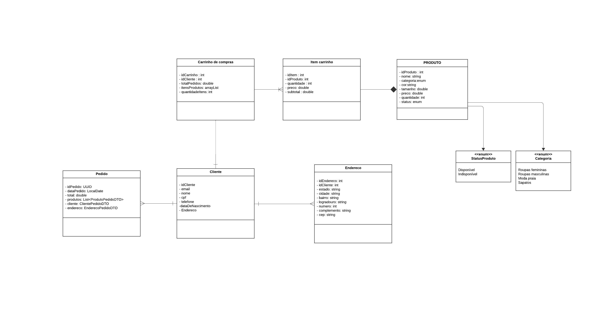
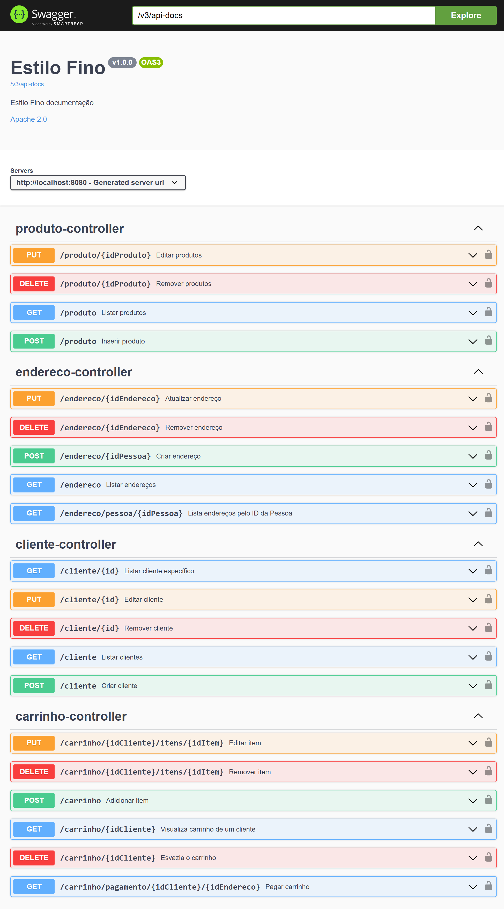
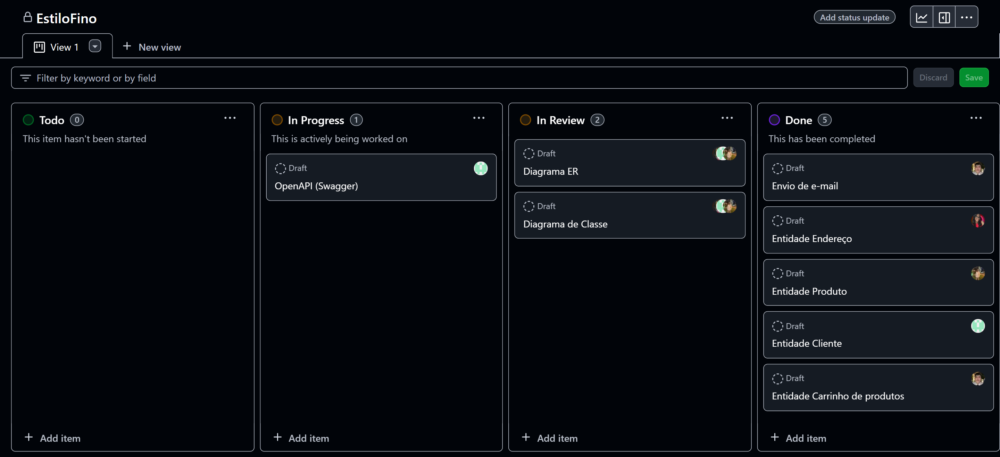

# EstiloFino


## ÍNDICE
1. [Descrição do Projeto](#1-descrição-do-projeto)
2. [Diagrama de Classe](#2-diagrama-de-classe)
3. [Diagrama ER](#3-diagrama-er)
4. [Como Acessar o Código](#4-como-acessar-o-código)
5. [Swagger_ui](#5-swagger-ui)
6. [Organização_do_projeto](#6-organização-do-projeto)
7. [Como_contribuir](#7-como-contribuir-)
8. [Autores](#8-autores)

---

## 1. Descrição do Projeto
## EstiloFino API  

A **EstiloFino API** é uma solução moderna e eficiente desenvolvida para otimizar a gestão de lojas de moda e varejo. Com recursos como cadastro de clientes e endereços, gerenciamento de produtos, carrinho de compras dinâmico e controle detalhado de itens no carrinho, nossa API proporciona uma experiência de compra fluida e integrada. <br> 
Ideal para lojas físicas e e-commerces, a EstiloFino API é escalável, fácil de integrar e projetada para melhorar a satisfação dos clientes enquanto simplifica a administração do negócio.  

---

## 2. Diagrama de classe

<a href="https://lucid.app/lucidchart/80480b34-da8f-4cbd-98da-e0f692cef36a/edit?viewport_loc=-635%2C-181%2C3840%2C1776%2CHWEp-vi-RSFO&invitationId=inv_ba0dfa82-f5e5-4156-9e88-b5316a3bbdd4">Clique aqui para acessá-lo na web!</a>

---

## 3. Diagrama ER

<a href="https://lucid.app/lucidchart/9bdd8269-4bf3-4149-8dce-eba13f3f85f4/edit?viewport_loc=-97%2C-41%2C2219%2C1041%2C0_0&invitationId=inv_c81e9285-7ab3-43db-97e6-439b2198bd74">Clique aqui para acessá-lo na web!</a>

---

## 4. Como acessar o código
1. Clone o repositório:
   ```bash
   git clone https://github.com/tarciana23/vs15-EstiloFino
2. Importe o projeto na sua IDE.
3. Compile a api.
4. <a href="http://localhost:8080/swagger-ui/index.html#/"> Clique aqui para acessar os endpoints no Swagger</a>

---

## 5. Swagger ui


## 6. Organização do Projeto
- 📌 Kanban: Feito no GitHub/Projetcs e utilizado para gerenciar tarefas e acompanhar o progresso do desenvolvimento.<br>
.   

## 7. Como Contribuir 
- Faça um fork do projeto.
- Crie uma branch para a sua feature:
- <code>git checkout -b "nome-da-feature"</code>
- Realize as alterações necessárias e faça commit.
- Envie um pull request explicando suas alterações.

## 8. Autores
- Tech lead: <strong>Tarciana Souza Oliveira</strong> - <a href="https://github.com/tarciana23">GitHub</a>.
- <strong>Bruno Gomes De Souza</strong> - <a href="https://github.com/bruno-gomes97">GitHub</a>.
- <strong>Leonardo Rodrigues</strong> - <a href="https://github.com/rleo05">GitHub</a>.
- <strong>Mateus Rodrigues Lima</strong> - <a href="https://github.com/mateuszzinn">GitHub</a>.

<footer style="text-align: center;">
        <p>&copy; EstiloFino</p>
</footer>